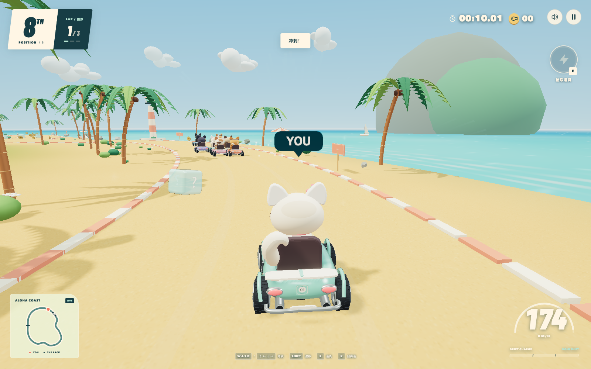
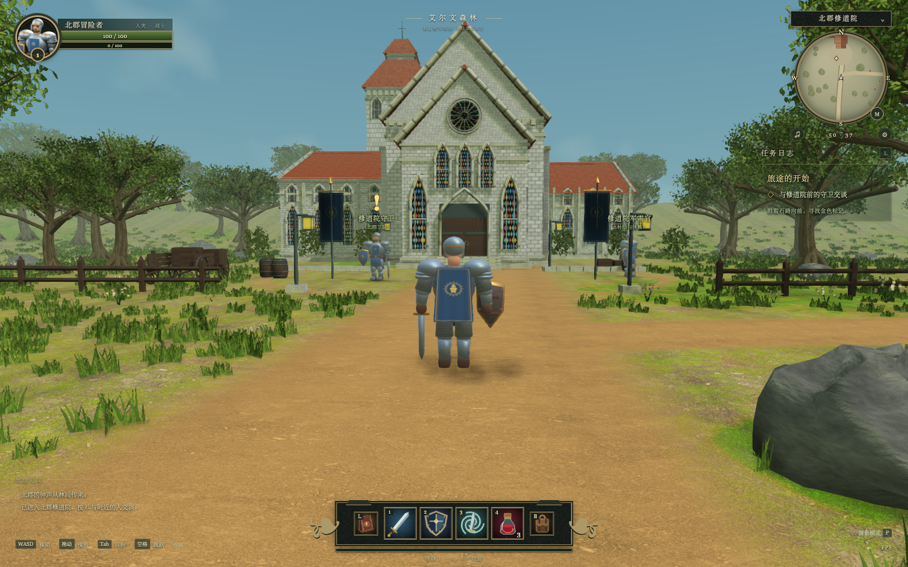
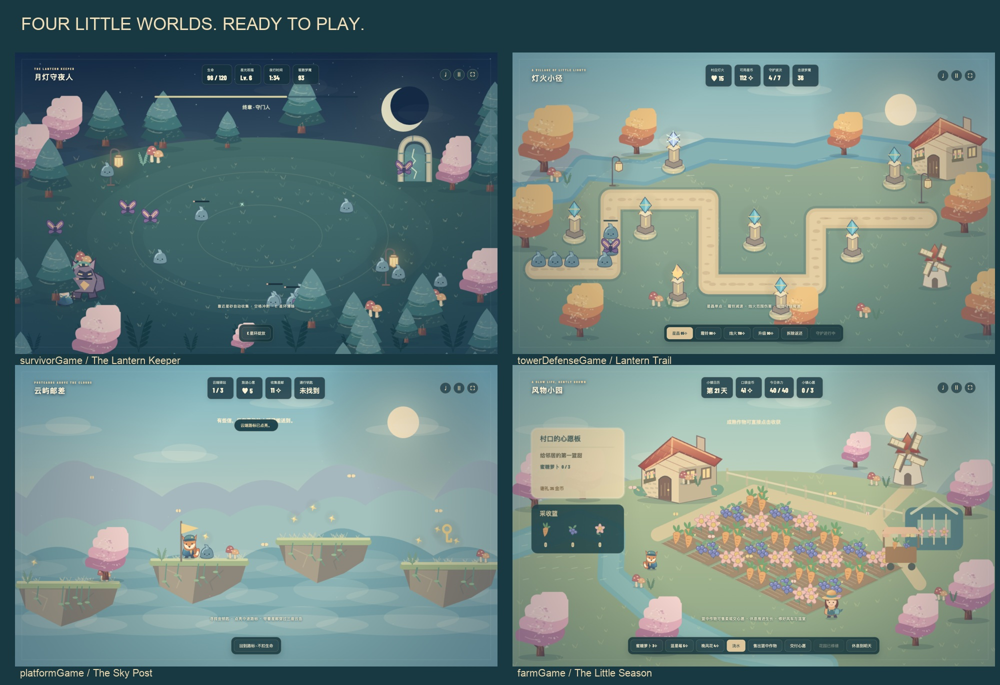
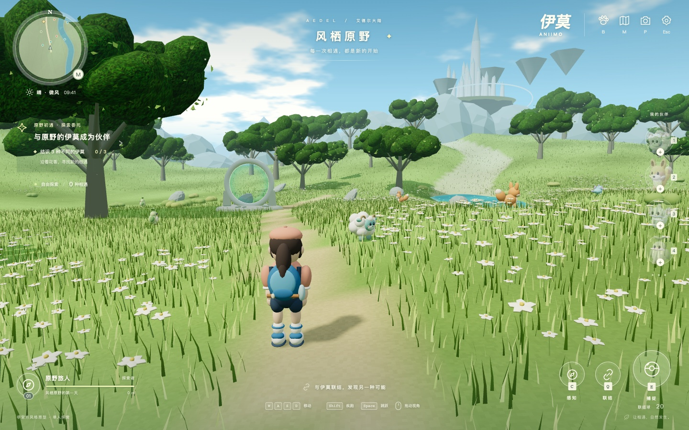
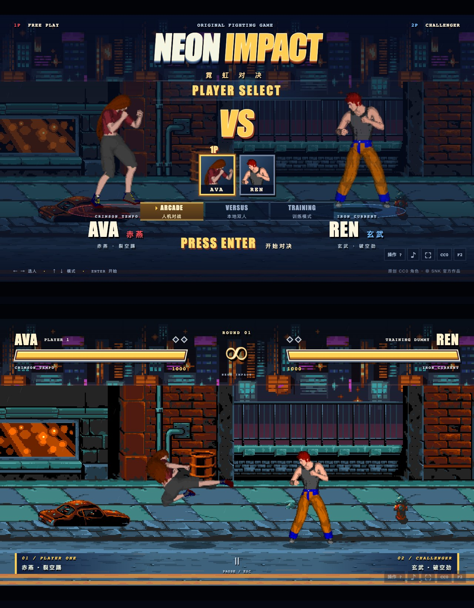

# VibeGaming · 独立游戏 Skill 大包

**安装一个 skill，让模型＋code agent 从完整工程出发，生成、运行并继续创作可玩的游戏。**

这里不是九份“请帮我做游戏”的提示词，而是 **9 个独立完整包**：技能指令、完整源码、本地美术、玩法实现、生成/启动工具和改造经验一起提供。只安装所需的一个，不必收集原始 `*-note` 文件夹或依赖其他 skill。

> **当前：`2026.09.18-rc1` 私有冻结候选，不是已公开发布的开源正式版。**
> 九包内容可校验；但整个仓库的开放源代码许可证、部分研究图片分发权、Git 历史清理及大文件发布仍有待办，见 [许可](LICENSE.md) 和 [冻结审查](docs/FREEZE-REVIEW.md)。本仓库没有官方游戏厂商授权，也不承诺任意模型一次实现任意创意。

## 目录

- [选哪个包](#选哪个包)
- [看实际画面](#看实际画面)
- [安装一个完整-skill](#安装一个完整-skill)
- [怎么触发九个包都有例子](#怎么触发九个包都有例子)
- [不经过模型直接生成和启动](#不经过模型直接生成和启动)
- [环境与离线能力](#环境与离线能力)
- [目录结构与验证](#目录结构与验证)
- [常见问题](#常见问题)
- [许可贡献与发布](#许可贡献与发布)

## 选哪个包

**显示名/ZIP 保留大小写；安装文件夹与 `$调用ID` 统一小写。** 表中的 ZIP 是仓库内文件，**不是已经建立的 GitHub Release**。正式公开后应从维护者发布的 Release 附件下载完整 ZIP；尚未提供 Release 地址时，不要猜测下载链接。

| 独立包 | 安装文件夹 / 调用 ID | 完整游戏起点 | ZIP 大小 | 详细说明 |
|---|---|---|---:|---|
| [maomao3Dgame.zip](maomao3Dgame.zip) | `maomao3dgame` / `$maomao3dgame` | 3D猫猫卡丁车；选人、漂移道具、完赛、触屏、摄影 | 17.3 MiB | [说明](使用说明.md) |
| [moshougame.zip](moshougame.zip) | `moshougame` / `$moshougame` | 3D奇幻冒险；战斗、采集、任务、奖励、存档 | 27.1 MiB | [说明](使用说明.md) |
| [allGame.zip](allGame.zip) | `allgame` / `$allgame` | 赛车＋第三人称冒险两套基础与通用创作方法 | 44.4 MiB | [说明](allGame-使用说明.md) |
| [survivorGame.zip](survivorGame.zip) | `survivorgame` / `$survivorgame` | 月灯守夜人；自动攻击、升级选卡、首领终局 | 0.8 MiB | [说明](创作游戏-使用说明.md) |
| [towerDefenseGame.zip](towerDefenseGame.zip) | `towerdefensegame` / `$towerdefensegame` | 灯火小径；建塔、升级拆除、敌潮和胜负 | 0.8 MiB | [说明](创作游戏-使用说明.md) |
| [platformGame.zip](platformGame.zip) | `platformgame` / `$platformgame` | 云屿邮差；三关、二段跳、收集、检查点、终点 | 0.6 MiB | [说明](创作游戏-使用说明.md) |
| [farmGame.zip](farmGame.zip) | `farmgame` / `$farmgame` | 风物小园；种植、浇水、收获、订单、修缮、存档 | 0.8 MiB | [说明](创作游戏-使用说明.md) |
| [yimoGame.zip](yimoGame.zip) | `yimogame` / `$yimogame` | 风栖原野；3D探索、捕捉、联结变身、委托完成 | 163.3 MiB | [说明](yimoGame-使用说明.md) |
| [quanwangGame.zip](quanwangGame.zip) | `quanwanggame` / `$quanwanggame` | 霓虹对决；街机格斗、人机/双人/训练、必杀连击 | 165.2 MiB | [说明](quanwangGame-使用说明.md) |

**选择建议：** 明确要某种游戏就选对应专用包；赛车/探索混合创作可选 allgame。allgame 不是万能全类型引擎，也不会自动把所有九包组合起来。

原样复刻可直接使用完整实现；内置主题是已实现起点；任意新场景、新角色、新机制仍需 Agent 真正编写和构建。`rebuild` 表示可选的从空实现重写，**不是默认“安装后直接玩”的路线**。

## 看实际画面

以下为真实工程截图，不是宣称由每个模型新生成的效果。

| 猫猫赛车 | 奇幻任务 |
|---|---|
|  |  |



| 风栖原野 | 霓虹对决 |
|---|---|
|  |  |

“惊艳”是创作目标，不是所有模型、显卡、字体或设备上都能保证的成绩。

## 安装一个完整 skill

### 方式 A：下载 ZIP，手动安装（适合大多数人）

1. 从可信分发渠道取得对应 ZIP 和同名 `.zip.sha256`，只选一个即可。
2. 校验文件。macOS：`shasum -a 256 -c quanwangGame.zip.sha256`；Linux：`sha256sum -c quanwangGame.zip.sha256`。Windows PowerShell：`Get-FileHash .\quanwangGame.zip -Algorithm SHA256`，对照 `.sha256` 内的值。**哈希证明传输一致，不是作者数字签名。**
3. 解压，得到一个小写名称的文件夹，例如 `quanwanggame/`。其中直接有 `SKILL.md`、`assets/`、`scripts/` 等。
4. 将**整个文件夹**放入目标 code agent 的技能目录。不要只复制 `SKILL.md`，不要变成 `skills/quanwanggame/quanwanggame/SKILL.md` 的多套一层结构。
5. 刷新 Agent 技能列表或新开会话，然后在聊天框输入下方调用示例。不是在终端输入 `$quanwanggame`。

Codex：使用当前环境的 `$CODEX_HOME/skills/`；未设置时一般是 `~/.codex/skills/`。不同客户端可能改过 CODEX_HOME，请以实际设置为准，不照抄作者机器路径。其他 Agent 使用其文档规定的技能位置；不要求各厂商目录完全相同。

最终结构示例：

```text
<你的技能目录>/
└── quanwanggame/
    ├── SKILL.md
    ├── agents/
    ├── assets/
    ├── references/
    └── scripts/
```

### 方式 B：已拿到完整仓库，使用安全安装脚本

在本仓库根目录运行，`--skills-dir` 明确指定目标技能目录。脚本校验 ZIP、拒绝路径穿越和覆盖；**不会联网、启动游戏或安装全局依赖**。

```bash
# macOS / Linux：先预览，再实际安装（只去掉 --dry-run）
python3 scripts/install_skill.py --skill quanwanggame \
  --skills-dir "${CODEX_HOME:-$HOME/.codex}/skills" --dry-run
python3 scripts/install_skill.py --skill quanwanggame \
  --skills-dir "${CODEX_HOME:-$HOME/.codex}/skills"
```

```powershell
# Windows PowerShell
$SkillDir = if ($env:CODEX_HOME) { Join-Path $env:CODEX_HOME "skills" } else { Join-Path $HOME ".codex/skills" }
py -3 scripts/install_skill.py --skill quanwanggame --skills-dir $SkillDir
```

替换 `--skill` 为表中任一小写 ID。已有同名安装时会停止：先由你备份/移走旧版，再安装新版，不提供盲目 `--force`。本轮仓库审查不代表这些包已安装到读者机器上。

### 不支持 skills 自动发现的 Agent

不需要换模型。让具备本地文件与终端工具的 Agent 直接读文件：

```text
读取 /实际路径/quanwanggame/SKILL.md，以该目录为资源根。
在工作区的新目录完整复刻游戏并启动，不依赖原note目录，不只给方案。
```

只有纯聊天能力、不能读文件或执行命令的模型不能自行完成本地构建；此时可以按下面终端命令由人运行。

### 如果通过 Git 克隆

本候选为三个 >100MiB 文件配置了 Git LFS，**维护者还没有在此目录完成 LFS 初始化/历史迁移，也没有提供公开远端地址**。公开仓库准备完成后，安装 Git LFS 并执行 `git lfs pull` 取得真实内容，再运行校验。若看到 `version https://git-lfs.github.com/spec/v1` 的小文本，那是指针，不是完整素材/ZIP。

不要假设 GitHub 的 “Download ZIP” 自动包含 LFS 实体；优先使用维护者验证过的独立 Release 附件。[发布说明](docs/PUBLISHING.md) 列出了维护者步骤。

## 怎么触发：九个包都有例子

以下均为**聊天提示词**。安装名小写、`$` 是支持该语法的 Agent 的显式调用标记；其他 Agent 用“读取对应 SKILL.md”替代。

### 1. maomao3dgame — 猫猫赛车

```text
使用 $maomao3dgame，在新目录 my-kart 按 exact 模式完整复刻猫猫赛车。
保留选人、漂移、道具、完赛和触屏；生成并启动让我驾驶，不要只做主页。
```

换主题：要求“樱花山谷”，先用 `sakura` 可运行换肤，再让 Agent 实际改树木、赛道地标和 UI；不要把换配色等同于已经换了整个世界。

### 2. moshougame — 奇幻任务

```text
使用 $moshougame，在新目录 my-adventure 完整生成第三人称奇幻任务游戏。
保留移动战斗、采集、接交任务、奖励和存档，安装项目依赖并启动让我玩。
```

### 3. allgame — 通用3D创作

```text
使用 $allgame，选择 racing 基础，在新目录 my-island-race 制作海岛计时赛。
先运行完整赛车工程，再实际实现计时目标、结果界面和重开，交付可玩的地址。
```

探索任务用 `adventure` 基础。不是要求它凭空同时实现所有游戏类型。

### 4. survivorgame — 生存割草

```text
使用 $survivorgame，在新目录 my-survivor 生成月灯守夜人。
保留自动攻击、升级选卡、冲刺星环和首领终局，直接启动让我玩。
```

### 5. towerdefensegame — 塔防

```text
使用 $towerdefensegame，在新目录 my-tower-defense 生成灯火小径。
保留建造、升级拆除、完整敌潮和胜负结算，直接启动让我玩。
```

### 6. platformgame — 平台跳跃

```text
使用 $platformgame，在新目录 my-platform 生成云屿邮差。
保留三关、二段跳、收集、敌人、检查点、钥匙和终点，直接启动让我玩。
```

### 7. farmgame — 农场

```text
使用 $farmgame，在新目录 my-farm 生成风物小园。
保留种植浇水、生长收获、售卖订单、修缮和本地存档，直接启动让我玩。
```

### 8. yimogame — 3D萌宠探索

```text
使用 $yimogame，在新目录 my-yimo 完整复刻风栖原野。
保留3D角色场景、捕捉、伙伴联结、地图图鉴、委托通关和存档，直接生成并启动。
```

### 9. quanwanggame — 街机格斗

```text
使用 $quanwanggame，在新目录 my-fighter 完整复刻霓虹对决。
保留原生角色动画、街机选人、人机/双人/训练、必杀连击与回合胜负，直接生成并启动。
```

### 换风格/角色/地图的通用补充

```text
以完整可玩工程为起点，把主题改成【你的设定】。
真正修改角色轮廓、场景布局、光色和HUD，不只改名字。
保留【需要的玩法闭环】，全部修改在新项目目录中进行；重新构建并启动，
提供实际截图、操作方法与未完成项，不修改skill里的冻结参考工程。
```

## 不经过模型：直接生成和启动

先令 `KIT` 指向**一个完整 skill 的目录**，`OUT` 指向**工作区中尚不存在的新目录**。macOS/Linux示例：

```bash
KIT="/实际路径/quanwanggame"
OUT="$HOME/game-projects/my-new-game"
```

以下不是九条一起运行，按你选择的包执行对应小节。Windows用真实路径替换变量，`python3` 改成 `py -3`；Node命令不变。路径含空格时保留引号。

### 猫猫 / 奇幻：`maomao3dgame`、`moshougame`

```bash
python3 "$KIT/scripts/project.py" verify
python3 "$KIT/scripts/project.py" create --mode exact --out "$OUT"
cd "$OUT"
npm ci --no-audit --no-fund
npm run build
npm run dev -- --host 127.0.0.1 --port 4301 --strictPort
```

打开 `http://127.0.0.1:4301/`。这两个包首次重编译需要npm网络或已有缓存。猫猫exact另有预编译dist，可在恢复目录执行 `python3 -m http.server 4301 --bind 127.0.0.1 --directory dist`；**moshougame基线没有dist，不能把它宣传成无需安装/构建即可运行**。

### allgame

```bash
python3 "$KIT/scripts/game.py" verify
python3 "$KIT/scripts/game.py" create --family racing --mode exact --out "$OUT"
# 或 --family adventure
cd "$OUT"
npm ci --no-audit --no-fund
npm run build
npm run dev -- --host 127.0.0.1 --port 4301 --strictPort
```

### 四款2D创作包

```bash
python3 "$KIT/scripts/game.py" verify
python3 "$KIT/scripts/game.py" create --out "$OUT"
python3 "$OUT/start.py" --port 4310
```

打开 `http://127.0.0.1:4310/`。不需要Node/npm。支持的主题：

| skill | 默认 / 另一主题 |
|---|---|
| survivorgame | `moon` / `ember` |
| towerdefensegame | `lantern` / `snow` |
| platformgame | `cloud` / `dusk` |
| farmgame | `spring` / `autumn` |

可加 `--theme`，如 `create --theme dusk --out "$OUT"`；仅用于相应skill。标题选项不会自动生成新人物或关卡。

### yimogame

```bash
python3 "$KIT/scripts/reproduce.py" play --out "$OUT" --port 4493
```

打开 `http://127.0.0.1:4493/`，Python直接服务随包成品，无需先装Node。下次重开：

```bash
python3 "$KIT/scripts/reproduce.py" serve --project "$OUT" --port 4493
```

### quanwanggame

```bash
python3 "$KIT/scripts/game.py" play --out "$OUT" --port 4496
```

打开 `http://127.0.0.1:4496/`。下次重开：

```bash
python3 "$OUT/start-demo.py" --port 4496 --no-open
```

以上服务需保持运行，Ctrl+C停止；端口占用就换端口，不结束其他项目进程。**这些localhost地址是运行命令后的本机地址，不是面向所有读者的在线演示链接。**

有开发需求时，yimogame 用 `python3 "$KIT/scripts/reproduce.py" install --project "$OUT"`；quanwanggame 用 `node "$KIT/scripts/install-offline.mjs" "$OUT"`，使用各自随包离线缓存。之后在OUT修改并 `npm run build`，否则dist还是原版。

## 环境与离线能力

| 包 | 直接试玩 | 修改/重编译 | 美术/声音运行时 |
|---|---|---|---|
| maomao3dgame | exact dist可用Python服务；变体须构建 | Node/npm；首次需网络/已有缓存 | 本地程序化几何、字体、合成声音 |
| moshougame | 须先npm安装/构建或启动Vite | Node/npm；首次需网络/已有缓存 | 本地GLB、纹理、图标、声音 |
| allgame | 按racing/adventure基础分别处理 | Node/npm；首次需网络/已有缓存 | 素材全部内置 |
| 四款2D | Python＋现代浏览器，无npm | 改ES modules/SVG即可；无需打包器 | 本地SVG、字体、Canvas和合成声音 |
| yimogame | Python＋WebGL2浏览器，无npm | Node/npm；69份锁定包的离线缓存 | 本地3D几何/着色器，声音默认关 |
| quanwanggame | Python＋WebGL浏览器，无npm | Node/npm；85份锁定tarball | 本地图集、街景、OGG音效 |

- Python建议3.9+。3D包启用浏览器硬件加速；Chrome为当前主要验证浏览器，现代Edge/Safari等未穷尽实测。
- 开发建议兼容Node 22/24 LTS并满足各锁定工具要求；冒险原生TS测试需Node22.18+ / 24+；quanwang要求Node20.19+或兼容22.12+。不要擅自 `npm update`。
- Python、Node、浏览器安装器和部分系统字体不随包提供。离线大包不等于整个操作系统开发环境也被打包。
- 无必需的模型API Key、账号、MCP、生图服务或Blender；可选重导素材/像素差异工具有Pillow、NumPy、requests等额外前置，见各包说明。
- 功能测试、哈希一致和画面审美是不同指标；测试截图夹具不等于真实帧率或人工全程通关。

## 目录结构与验证

```text
README.md                    新用户主入口：安装、九包调用、生成启动、限制
packages.json                九包ID/文件名/大小/SHA-256清单
release-manifest.json        本冻结候选的逐文件锁定清单
*.zip + *.zip.sha256         九个可独立安装的大包
skills/<id>/                与对应ZIP一致的完整skill源目录
scripts/                     仓库校验、安装和干净目录导出工具
.github/                     CI与问题模板（未远程执行）
docs/                        冻结审查、发布/许可检查说明
*-使用说明.md / *-交付记录.md  各批次详细/历史资料
verification/                本地生成工程、依赖、日志；不属于公开源码发行集
playable-games/              本地演示副本，可从skill重新生成；不属于冻结发行集
```

根 `使用说明.md` 和各批次说明保留历史交付信息；**“本机已安装”“服务已启动”只描述作者当时环境，不适用于下载者。以本README为安装入口。**

在完整仓库根运行：

```bash
python3 scripts/audit_packages.py --check-lock
```

检查九包ZIP校验、每个ZIP内的全部文件与skill源目录一致、单个SKILL入口、调用ID、维护文档链接与冻结清单。不联网、不重新测试全部玩法。机器报告和本轮范围见 [冻结审查](docs/FREEZE-REVIEW.md)，旧玩法结果分别见 [原两包](验证报告.md)、[allGame](allGame-验证报告.md)、[四款2D](创作游戏-交付记录.md)、[yimo](yimoGame-交付记录.md)、[quanwang](quanwangGame-交付记录.md)。

维护者修改文件后不能继续声称原锁未变；应先检查差异、复核对应包，再显式创建新候选清单，见 [发布说明](docs/PUBLISHING.md)。

## 常见问题

**安装后找不到 skill？** 检查小写文件夹/ID、是否多嵌套一层、整个assets是否齐全、Agent实际技能目录和重扫机制。可先直接读取SKILL.md使用。

**只有源码、没有画面？** 保持本地服务运行，通过HTTP打开，不双击HTML。moshou/变体需安装和构建；修改源码后不要误看旧dist。

**哈希不符或缺素材？** 重新取完整分发文件；检查Git LFS指针。不改manifest“消除错误”，不随意换CDN或生成占位素材。

**输出目录已存在？** 脚本为防覆盖而停止。新建不同路径；续作在已有工程增量修改，不再次create/play。

**macOS 的 `/tmp`、符号链接路径被四款2D工具拒绝？** 这些生成器采取严格符号链接保护，可选工作区的真实路径，例如 `~/game-projects/新目录`，或把父路径解析为真实路径再传入；不要为方便删除安全检查。

**手机能玩？** 各包支持范围不同；四款2D和格斗推荐横屏。格斗触控只控制P1，P2需要数字小键盘。模拟触屏测试不是实体手机认证。

**能做官方魔兽/伊莫/拳皇完整版吗？** 不能这么表述。这里是有限范围的单人原型、赛车/小游戏或两角色原创素材格斗Demo，没有自动提供官方授权、MMO服务器、联网回滚等。

**可以商用/公开转载整个包吗？** 不能一概回答可以。需按包确认源代码、美术、字体、研究截图、品牌与依赖各自权利，见下节。

## 许可、贡献与发布

- [LICENSE.md](LICENSE.md)：**许可范围说明，不是整个仓库的统一开源授权**。
- [第三方与权利清单](docs/RIGHTS.md)：逐包证据与待确认项，公开前必须处理。
- [CONTRIBUTING.md](CONTRIBUTING.md)：新增/改包、同步ZIP/哈希/说明、验证与报告要求。
- [SECURITY.md](SECURITY.md)：本地脚本/依赖执行边界和安全问题报告。
- [CHANGELOG.md](CHANGELOG.md)：候选版本变更。
- [发布与冻结清单](docs/PUBLISHING.md)：清理Git历史、大文件/LFS、干净导出、生成锁和发布门槛。

没有伪造下载量、在线Demo、测试徽章或全仓MIT标记。维护者确认权利和发布方式后，才能将“私有冻结候选”改为公开发行状态。
