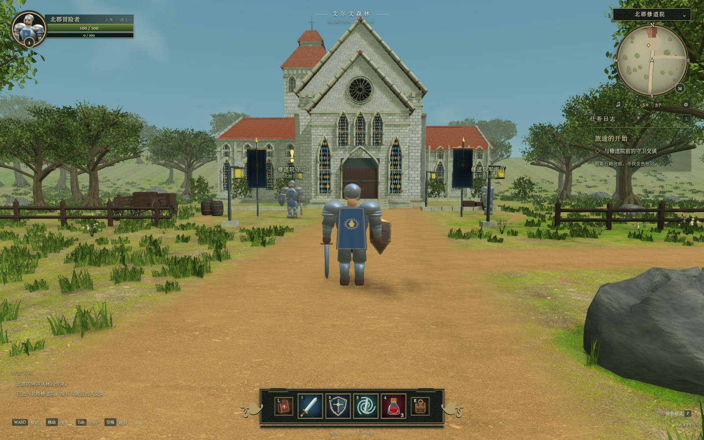

# 北郡 · 经典之境

**以《魔兽世界》经典区域北郡修道院为参考的非官方、单人、第三人称网页版 Demo。**

这是一份可运行、可完成任务、有本地存档的游戏切片，不是静态概念图。建筑和人类战士为原创重建，外部美术只使用已核验的 CC0 素材；不包含暴雪客户端提取资源、原版音乐或官方 Logo。

> **范围说明**：目前是风格化重建，并非 1:1 地图或 AAA 高清重制成品。可玩区域为修道院外庭、入口道路与东侧林地；修道院内部尚未开放。角色细节、动作融合、地貌与原作比例仍有提升空间。



## 本地运行

已测试环境：macOS / Node.js 25.8.1 / 桌面 Google Chrome，启用硬件加速。

```bash
cd northshire
npm ci
npm run dev -- --port 4173
```

打开 `http://localhost:4173`。如果已经处于 `northshire` 目录，不必再次 `cd`。

- 运行依赖已锁在 `package-lock.json`。首次 `npm ci` 需要访问 npm 源。
- **全部游戏美术、声音、贴图均随项目提供，不在运行时连接任何外部素材站/CDN。**
- 运行游戏无需 Blender、Python、账号、API Key 或联网下载美术。
- 不是双击 `index.html` 即可运行的单文件游戏；需通过 HTTP 开发服务器或静态服务器访问。
- 以桌面键鼠为目标；没有实现手机触控操作。

### 构建与静态部署

```bash
npm run build
npm run preview -- --port 4174
```

生产文件在 `dist/`。可将该目录部署到静态站点的**域名根路径**。当前资源 URL 使用 `/assets/`，若需要二级目录部署，要同步调整资源路径；不能只修改 Vite 的 `base`。

## 怎么玩

1. 点击「开始冒险」，沿路走向修道院前带金色 `!` 的守卫。
2. 靠近按 `E` 交谈，接受原创任务「林地的骚动」。
3. 向右前往东部林地，左键或 `Tab` 选择森林狼，靠近后按 `1` 开始自动近战。
4. 清理 **3 只森林狼**，在林间石圈花圃采集 **2 束宁神花**。
5. 返回守卫处交任务，获得经验、铜币和药水，升到 2 级。
6. 可继续探索、找军需官免费休整，或进入摄影模式保存图片。

| 按键 | 功能 |
|---|---|
| `W A S D` / 方向键 | 相对镜头移动 |
| `Shift` | 奔跑 |
| `Space` | 跳跃 |
| 鼠标左/右键拖动 | 环绕镜头 |
| 滚轮 | 镜头缩放 |
| 左键 / `Tab` | 选中 / 切换附近目标 |
| `1` | 开关自动近战；实际挥砍有攻击间隔 |
| `2` | 盾牌猛击：消耗怒气，伤害并眩晕 |
| `3` | 旋风斩：消耗怒气，对身旁敌人造成伤害 |
| `4` | 使用一瓶治疗药水 |
| `E` | 交谈、采集、拾取战利品 |
| `B` | 行囊；点击药水可以使用 |
| `L` / `Q` | 任务日志 |
| `M` | 区域地图 |
| `P` | 摄影模式：暂停玩法，保留镜头环绕与 PNG 导出 |
| `Esc` | 关闭窗口 / 打开暂停设置 |

### 存档与恢复

- 自动保存等级、经验、生命、金币、药水、任务计数、位置和游玩时长。
- 使用当前浏览器、当前网站来源下的 `localStorage`；不同端口/浏览器不共用。
- 设置窗口中可手动保存；「重置存档」有二次确认和取消。
- 无痕模式或禁用网站存储时，游戏可继续运行，但存档可能不可用。
- 世界生物重置、已采集花圃的可见状态不跨会话持久化；任务计数会保存。

## 已实现

- 自由移动、奔跑、跳跃、第三人称镜头、建筑与树干阻挡。
- 雕刻地形、土路、完整枝干与叶簇、草丛、花卉、石块、木栅栏。
- 多翼修道院外观：石墙、红瓦斜屋面、扶壁、玫瑰窗、彩色玻璃、门把、台阶与檐饰。
- 原创人类战士 GLB、盔甲/锁子甲/织物材质、6 组动作；CC0 狼模型的再贴图与新动画。
- 敌人巡逻、追击、攻击、眩晕、死亡、掉落与再生；玩家死亡后返回庭院。
- 单条完整原创任务链，奖励、等级成长、军需官补给。
- 羊皮纸任务窗口、图标技能栏、真实模型头像、实时小地图与区域地图。
- 环境音、脚步、战斗、翻书与拾取音效；音量与静音控制。
- 高画质 / 均衡 / 流畅三档；摄影截图；资源加载失败明确阻止进入。

## 模块结构

```text
src/
  main.ts                  入口：创建游戏，不承载玩法
  app/game.ts              场景与子系统编排
  core/                    输入、数学工具、存档/运行时状态
  world/                   地形、建筑、植被、道具、材质、批次几何
  actors/                  GLB角色、动作与玩家控制器
  gameplay/                战斗、技能、敌人行为
  data/content.ts          任务文案、NPC/敌人/草药配置
  presentation/            声音、特效
  ui/                      HUD、窗口、小地图、样式
public/assets/             随包交付的本地资源
  manifest.json            每个文件的来源、CC0证据、大小、SHA-256
```

更多设计与事实边界见 [架构说明](docs/ARCHITECTURE.md) 和 [参考记录](docs/REFERENCES.md)。

## 测试

```bash
npm test                           # 15项纯状态/数学单元测试
npm run build                      # TypeScript检查 + 生产构建
python3 tools/audit_assets.py --check  # 全量资源哈希/清单检查

# 先启动4173端口的开发服务器，再跑真实浏览器测试
node tools/test-playthrough.mjs
node tools/test-edges.mjs
node tools/inspect.mjs
```

浏览器脚本使用 macOS 的 Chrome 路径。其他环境请设置 `CHROME_PATH` 为本机 Chrome 路径。测试脚本所需 Playwright 在开发依赖中。报告与真实截图见 `screenshots/`；验收范围与局限见 [测试报告](docs/TESTING.md)。

测试中的 `?test=1` 调试接口**只在开发构建**存在。端到端测试使用传送缩短走路时间，但接任务、战斗、采集、交任务均通过真实 UI/键盘与正式玩法代码完成；不将传送测试当作人工完整徒步试玩。

## 美术与授权

本包包含 **58 个美术/音频文件**，约 **16.2 MiB**。逐文件授权与哈希见 `public/assets/manifest.json`。

- ambientCG：Ground037、Wood051。
- Poly Haven：forest_slope HDR 环境。
- Kenney：RPG Audio、Impact Sounds、Fantasy UI Borders 中选取的资源。
- OpenGameArt：逐项目核验为 CC0 的狼模型、森林环境音。
- 其余模型、贴图、图标、场景几何为此 Demo 原创建模/绘制。

**不能把 OpenGameArt、Freesound 等整个站点视为 CC0。** 素材页面与下载检验记录保存在 `docs/licenses/`、`docs/download-audit.json`。本站访问实测只能代表制作时的机器和网络，不能据此保证所有国内网络线路稳定；将素材全部本地化避免了运行时依赖这些站点。

代码许可证：[MIT](LICENSE)。美术说明：[ASSETS-LICENSE.md](ASSETS-LICENSE.md)。第三方软件许可证：[THIRD_PARTY_NOTICES.md](THIRD_PARTY_NOTICES.md)。CC0 声明不覆盖《魔兽世界》名称、设定和相关第三方权利。

### 可选：重新生成美术

成品资源已提供，这一步**不影响游玩**。需要 Python + Pillow + NumPy、Blender（制作时为 5.2.1）。

```bash
python3 tools/download_sources.py     # 下载审计记录中的固定来源并验证SHA-256
python3 tools/prepare_assets.py
python3 tools/build_ui.py
python3 tools/build_surface_details.py
blender --background --factory-startup --disable-autoexec --python tools/build_knight.py
blender --background --factory-startup --disable-autoexec --python tools/build_wolf.py
python3 tools/audit_assets.py
```

源下载内容如发生变化会校验失败，需要重新核验，不会静默接受新来源。狼原始 `.blend` 中未随包提供的照片引用未被使用；重建时禁用其内嵌脚本自动执行。
